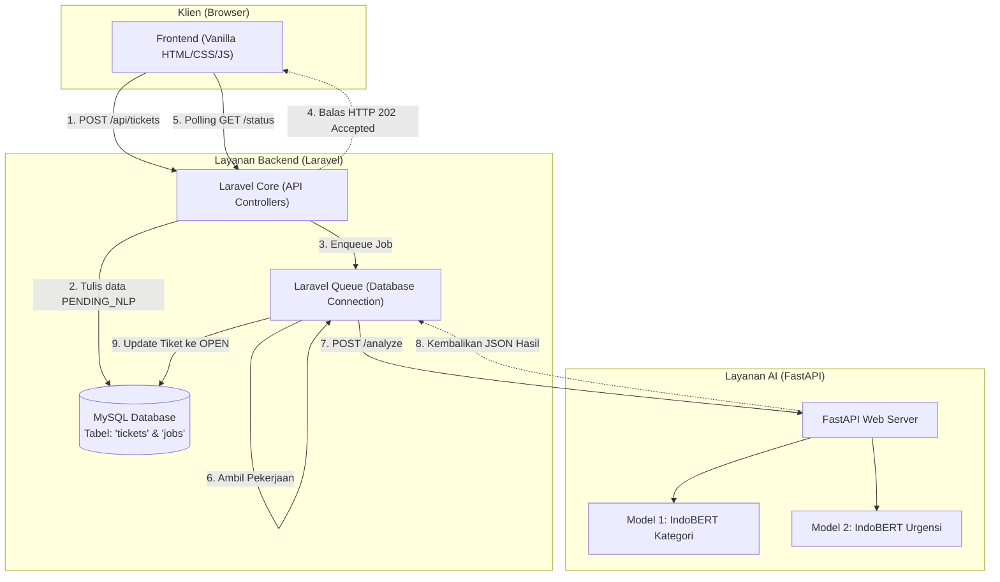
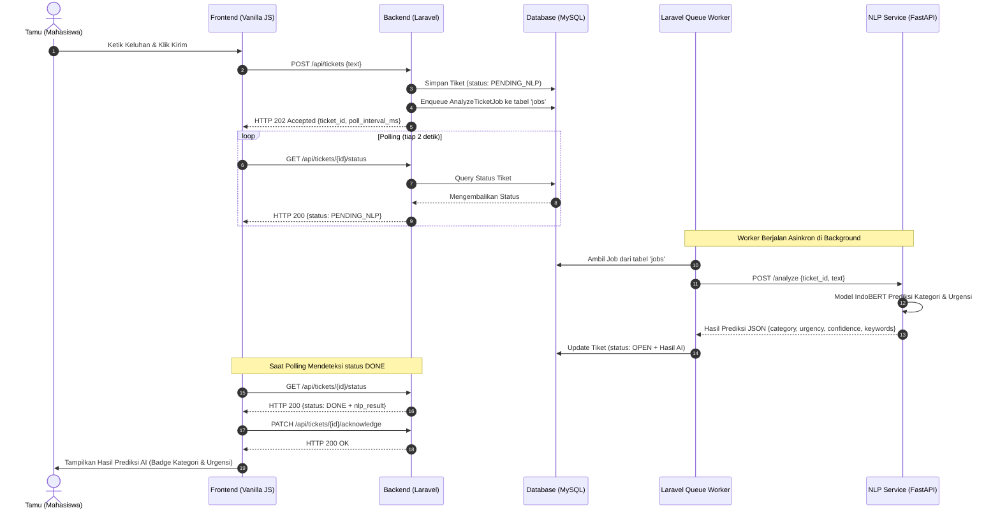

# 🏛️ Smart Campus Helpdesk - Ticket Routing & Triage System
### Universitas Halu Oleo (UHO) — Tugas Akhir Machine Learning & Software Engineering

[](https://laravel.com)
[](https://fastapi.tiangolo.com)
[](https://pytorch.org)
[](https://huggingface.co)
[](https://www.mysql.com)
[](https://javascript.info)

Sistem Helpdesk Kampus Cerdas berbasis **Natural Language Processing (NLP)** yang mengotomatisasi pemilahan tiket keluhan mahasiswa. Aplikasi ini secara asinkron memprediksi **Kategori Departemen** (Auto-Routing) dan **Tingkat Urgensi** (Auto-Triage) menggunakan model **IndoBERT** terpisah untuk meningkatkan kecepatan respon layanan kampus.

---

## 🏗️ 1. Diagram Arsitektur Sistem

Sistem ini didesain khusus menggunakan arsitektur **Microservices Asinkron** agar antarmuka pengguna (Frontend) tetap responsif (<200ms) tanpa mengalami pembekuan halaman (*freeze UI*), meskipun inferensi model AI IndoBERT membutuhkan waktu 3–6 detik di CPU laptop standar saat pameran.



---

## 📡 2. Diagram Alur Data Asinkron (Sequence Diagram)

Berikut adalah siklus hidup (*lifecycle*) pemrosesan tiket, dari saat mahasiswa mengetik laporan secara anonim hingga admin melihat hasil klasifikasi AI di dashboard secara otomatis melalui teknik **Long Polling**:



---

## 📂 3. Struktur Direktori Proyek

```
FinalProjectMachineLearning/
├── 📂 backend/                  # Layanan Backend (Laravel PHP + MySQL)
│   └── 📝 README.md             # Panduan setup Laravel, skema database, & worker
│
├── 📂 frontend/                 # UI Mockup (Vanilla HTML/CSS/JS)
│   ├── 📂 css/styles.css        # Desain premium Glassmorphism & Outfit Typography
│   ├── 📂 js/main.js            # Lazy-Loading Throttled & Interaksi UI
│   ├── 📂 js/polling.js         # Polling State Machine & API Python Connector
│   └── 🖥️ index.html            # Portal Laporan Mahasiswa & Dashboard Admin
│
├── 📂 nlp_service/              # Layanan AI API (FastAPI Python)
│   ├── ⚙️ main.py               # API Python dengan Auto-Fallback Mock Mode
│   ├── 📄 requirements.txt      # Pustaka Python (FastAPI, Torch, Transformers)
│   └── 📝 README.md             # Panduan menjalankan service Python
│
├── 📂 ml_training/              # Training Model (Google Colab & Dataset)
│   └── 📂 data/                 # Dataset bersih bebas duplikat & split stratified (80/10/10)
│       ├── train.csv, val.csv, test.csv
│       ├── training_data.csv    # 1.813 data unik
│       └── training_data.txt    # Format FastText
│
└── 📂 docs/                     # Dokumentasi Perencanaan Tim
    ├── 📝 00_README.md          # Peta jalan kerja tim
    ├── 📝 PROJECT_BREAKDOWN.md  # Arsitektur lengkap & Kontrak API
    ├── 📝 DATASET_PLANNING.md   # Strategi pengerjaan dataset
    ├── 📝 TEAM_CHECKLIST.md     # Checklist tugas harian tim
    └── 📝 ML_TRAINING_GUIDE.md  # Panduan copy-paste Google Colab ML Lead
```

---

## 🚀 4. Panduan Memulai Cepat (Quick Start)

### A. Persiapan Dataset & Training Model (ML Lead)
* **Dataset:** Semua berkas dataset bersih dan split stratified (80/10/10) sudah siap di dalam folder `ml_training/data/`.
* **Training Colab:** Ikuti panduan lengkap langkah-demi-langkah serta skrip copy-paste yang telah disediakan di berkas [docs/ML_TRAINING_GUIDE.md](file:///d:/kuliah%20semester%206/ML/PROJEK%20AKHIR/FinalProjectMachineLearning/docs/ML_TRAINING_GUIDE.md) untuk melakukan training di Google Colab.
* **Ekspor Model:** Setelah training selesai di Colab, unduh folder `kategori_final/` dan `urgensi_final/` dari Google Drive Anda, lalu letakkan di folder lokal:
  ➡️ `nlp_service/models/`

### B. Jalankan FastAPI NLP Service (ML Lead / Fullstack)
FastAPI Python bertindak sebagai API inferensi model IndoBERT.
```bash
# Masuk ke folder service
cd nlp_service

# Install pustaka dependensi
pip install -r requirements.txt

# Jalankan server uvicorn
uvicorn main:app --reload --port 8000
```
> [!TIP]
> Jika folder model belum diisi bobot latih Colab, FastAPI akan otomatis masuk ke **Mock Mode (Heuristic Mode)** sehingga tim Frontend tetap bisa menguji integrasi visual secara dinamis kapan saja tanpa takut crash!

### C. Setup Laravel Backend (Backend Lead)
Laravel mengelola basis data MySQL dan antrean asinkron (Queue).
* Masuk ke folder `backend/` dan ikuti petunjuk setup Laravel, pembuatan database, migrasi tabel tiket, serta penulisan job asinkron pada panduan berkas [backend/README.md](file:///d:/kuliah%20semester%206/ML/PROJEK%20AKHIR/FinalProjectMachineLearning/backend/README.md).

### D. Jalankan Antarmuka Pengguna (Frontend Lead)
Frontend dibangun menggunakan **Vanilla HTML/CSS/JavaScript premium**.
* Cukup buka berkas [frontend/index.html](file:///d:/kuliah%20semester%206/ML/PROJEK%20AKHIR/FinalProjectMachineLearning/frontend/index.html) langsung di browser Anda (atau jalankan Live Server di VS Code).
* **Form Laporan:** Coba ketik keluhan, klik kirim, dan Anda akan disajikan animasi loading AI melingkar premium selama 1.5 - 3 detik selagi sistem melakukan polling asinkron, sebelum menampilkan hasil badge kategori dan urgensi AI secara dinamis.
* **Dashboard Admin:** Klik tab *Dashboard Admin* untuk melihat simulasi antrean tiket admin dengan fitur penapisan filter serta **Lazy-Loading Throttled** (scroll ke bawah untuk me-load baris baru secara dinamis).

---

## 🎯 5. Target Metrik Keberhasilan (ML Evaluation)

Model AI Anda wajib memenuhi target minimum evaluasi pada data uji (*test.csv*) sebelum digunakan saat pameran:

| Metrik Evaluasi | Batas Minimum Keberhasilan |
| :--- | :--- |
| **Akurasi Kategori (F1-Macro)** | **≥ 78.0%** |
| **Akurasi Urgensi (F1-Macro)** | **≥ 75.0%** |
| **Deteksi Urgensi KRITIS (F1-Score)** | **≥ 70.0%** |
| **Deteksi Kategori KEUANGAN (F1-Score)** | **≥ 70.0%** |

---

## 👥 6. Alokasi Peran Tim (6 Orang)
* **Project Lead (1 Orang):** Koordinasi keseluruhan, standup harian, and setup pameran.
* **Backend Lead (2 Orang):** Pembangunan Laravel API, MySQL, & Database Queue Worker.
* **Frontend Lead (1 Orang):** Pengembangan UI/UX, Polling State Machine, & Dashboard Lazy Load.
* **ML Lead (2 Orang):** Training model IndoBERT di Colab, integrasi FastAPI, & evaluasi metrik.

*Selamat bekerja tim Universitas Halu Oleo! Projek ini adalah cetak biru kokoh untuk pameran IT kampus yang luar biasa sukses! 🎉*